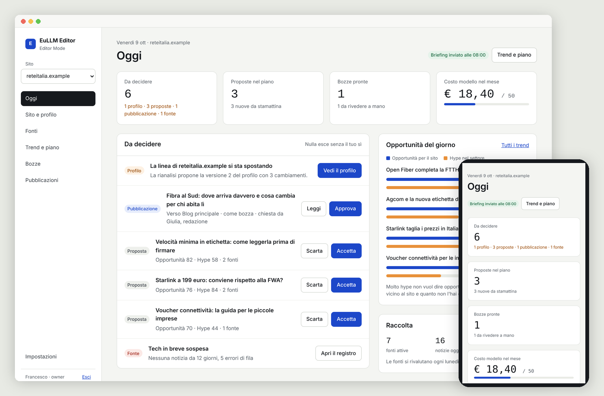

# EuLLM Agent

Autonomous ReAct agent with multi-provider LLM support (EuLLM Engine, Ollama,
OpenAI-compatible APIs, Anthropic), a small set of sandboxed tools, optional
modules and a Telegram interface.

**New in 0.3.0: the agent becomes a platform.** `eullm-agent api` turns it
into a multi-tenant Core that other applications build on:

- **The model proposes, the policy decides, a person approves.** Every
  sensitive action stops in an approval queue (API, Telegram or terminal).
- **Everything is on record.** Runs, model calls, tools and fetches land in
  PostgreSQL with an append-only audit trail.
- **Safe web access for apps.** `POST /v1/fetch` crawls with SSRF checks on
  every redirect, size limits and a per-host pace.
- **Costs under control.** Model router with fallback and pricing, budgets
  per run, and monthly and daily limits per tenant (`429` when reached).

[Editor Mode](editor-mode/), the first vertical built on the Core, uses it to run editorial
work for any domain: it reads the site, proposes an editorial line with
evidence, finds its own sources, separates hype from real opportunity and
drafts articles where every sentence cites a source. Nothing goes out
without a person's yes.



## Quick start

```bash
cargo build --release
cp config.example.yaml config.yaml     # or run without a config for a wizard
./target/release/eullm-agent run "List the files in the workspace"
./target/release/eullm-agent serve     # Telegram bot (needs telegram.allowed_users)
```

## Providers

| `provider.type` | Endpoint | Tool calling |
|---|---|---|
| `eullm` | `{base_url}/v1/chat/completions` (EuLLM Engine, OpenAI-compatible) | yes |
| `ollama` | `{base_url}/api/chat` (Ollama native) | yes |
| `openai` | `{base_url}/chat/completions` (default `https://api.openai.com/v1`) | yes |
| `anthropic` | `https://api.anthropic.com/v1/messages` | yes |

Secrets can be given as `api_key` / `token` or, preferably, as `api_key_env` /
`token_env` naming an environment variable. Every provider request has a
timeout (`limits.llm_timeout_seconds`) and is retried once on 429, 502, 503 or
504, honouring `Retry-After`.

**Upgrading from 0.1.x:** `type: eullm` now talks to the Engine's `/v1` API,
because the Engine's `/api/chat` ignores tools. If you were pointing
`type: eullm` at a plain Ollama server, change it to `type: ollama`.

## Security model

EuLLM Agent runs actions chosen by a language model, and a model can be steered
by any text it reads (a web page, a file, a message). So every capability that
touches the machine or the network is **off by default** and narrowly scoped
when turned on. See [config.example.yaml](config.example.yaml) for every
setting.

| Capability | Default | When enabled |
|---|---|---|
| `run_program` (`tools.exec`) | off | Only programs in `allowed_programs`, argv only (never a shell), run in a bubblewrap sandbox (no network, read-only system directories, only the workspace visible and read-only, own process tree, memory and file size limits), killed with everything they started on timeout, output capped |
| `read_file`, `list_dir` | on | Confined to `workspace`: `..`, absolute paths outside it and symlinks leading out are refused |
| `write_file` | off (`allow_write`) | Same confinement; never writes through a symlink; size capped |
| `fetch_url` (`tools.http`) | off | HTTPS GET only; every resolved address must be public (no loopback, LAN, link-local or cloud metadata); each redirect is checked again; the connection is pinned to the checked address; optional domain allowlist; body capped |
| Modules | off | Tools of modules an operator installed with `eullm-agent module install`; arguments are passed as single argv elements, file arguments are confined to the workspace. The agent cannot install modules |
| Telegram | needs config | Refuses to start without `allowed_users`; messages without a sender are ignored |

Each task is also bounded by `max_iterations`, `limits.max_run_seconds` and
`limits.max_tool_output_bytes`. The audit log (`audit_log`, JSONL, mode 0600)
records each run, model call (duration, tokens, errors) and tool call (name,
argument key names, outcome, duration); it never stores argument values,
prompts or outputs.

What this does not protect against: programs you allowlist run with the
agent's own user rights, so allowlisting an interpreter (`sh`, `python`, ...)
gives the model full control of that user. Run the agent as an unprivileged
user, ideally in a container.

## Core service (API)

`eullm-agent api` runs the agent as a service for other programs (for
example Editor Mode). The contract is
[docs/openapi.json](docs/openapi.json).

| Endpoint | What it does |
|---|---|
| `POST /v1/runs` | Start a run with a profile and an input; returns its id at once |
| `GET /v1/runs`, `GET /v1/runs/{id}` | Runs of the caller's tenant, with every model and tool call |
| `POST /v1/llm/chat` | One model call through the Model Router, recorded with tokens and cost |
| `GET /v1/approvals`, `POST /v1/approvals/{id}` | Actions waiting for a person; approve or deny |
| `POST /v1/fetch` | HTTP GET for applications (crawling, feeds) with the address checks of `fetch_url`, a size limit and a per-host pace; off unless `api.fetch` is set |
| `GET /v1/usage` | Runs, model calls, tokens, cost and fetches of the caller's tenant today and this month (UTC), with its limits; `api.tenants` sets the limits and a request over one gets 429 |

- **Tokens:** `eullm-agent token new` prints a token and its SHA-256; only the
  hash goes in `api.tokens`. Each token belongs to a tenant and can be limited
  to some profiles. Data is always scoped to the token's tenant.
- **State and audit:** with `database` configured, runs, model calls, tool
  calls, policy decisions and approvals are stored in the `core` schema of
  PostgreSQL (migrations run at start). `core.audit_events` is append-only:
  updates and deletes are refused by the database. Without a database the
  state is kept in memory.
- **Model Router and profiles:** `models` adds named models with fallback and
  pricing; `profiles` choose a model, the tools a run may use and its budget
  (`max_tokens`, `max_cost`, `max_iterations`, `max_run_seconds`).
- **Policy:** `policy_file` (see [policy.example.yaml](policy.example.yaml))
  decides `allow`, `deny` or `require_approval` per tool and profile. A run
  that has read external content is *tainted*, and from then on tools with
  side effects need approval. A tainted run that has also read local files or
  documents needs approval for `fetch_url` too, so injected instructions
  cannot send private data out. The model proposes, the policy authorises,
  the worker executes and the system records.
- **Approvals:** a run stops at the action and waits for a decision through
  the API, Telegram (`/approve <id>`, `/deny <id> [note]`, sent to the chat
  that started the task) or the terminal for `eullm-agent run`. No decision
  within `api.approval_timeout_seconds` counts as a refusal.

```bash
eullm-agent token new                          # put token_sha256 in api.tokens
DATABASE_URL=postgres://... eullm-agent api
curl -s -X POST localhost:8088/v1/runs -H "Authorization: Bearer $TOKEN" \
  -H 'content-type: application/json' -d '{"input":"List the workspace"}'
```

## Using it with EuLLM Engine

1. Start the Engine and note its address (default `http://localhost:11434`)
   and, if it runs with `EULLM_API_KEYS`, one of the keys.
2. Check that the OpenAI-compatible API answers and that the model is loaded:
   ```bash
   curl -s http://localhost:11434/v1/models -H "Authorization: Bearer $EULLM_API_KEY"
   ```
3. Configure the agent:
   ```yaml
   provider:
     type: eullm
     base_url: http://localhost:11434
     model: qwen3:8b            # a model with tool-calling support
     api_key_env: EULLM_API_KEY # omit if the Engine has no keys
   ```
4. Verify tool calling end to end; the agent must call `list_dir`:
   ```bash
   mkdir -p workspace && echo hello > workspace/note.txt
   RUST_LOG=eullm_agent=debug ./target/release/eullm-agent run \
     "Which files are in the workspace? Read note.txt and tell me its content."
   ```
   The progress lines show `tool:list_dir` and `tool:read_file`, the debug log
   shows `POST http://localhost:11434/v1/chat/completions`, and
   `eullm-agent-audit.jsonl` gets a `tool_call` entry per tool.

## Development

```bash
cargo fmt --check
cargo clippy --all-targets -- -D warnings
cargo test                 # unit, provider, agent and security regression tests
cargo test --test security # security regressions only
# PostgreSQL tests run when DATABASE_URL points at a disposable database:
DATABASE_URL=postgres://postgres@localhost/eullm_test cargo test --test pg_store
```

## License

EuLLM Agent is licensed under [AGPL-3.0-or-later](LICENSE). Use it, fork it,
modify it, run it commercially: the one condition is copyleft. If you modify
EuLLM Agent and let others use it over a network (including as a hosted
service), you must offer them the Corresponding Source of your modified
version. Versions published up to and including 0.1.7 remain available to
everyone under their original Apache 2.0 terms; the AGPL governs new work from
this change onwards.

**I3K Technologies Srl holds the copyright** and also offers this software
under a separate commercial licence, for organisations that cannot accept the
AGPL's terms. Enquiries: **info@i3k.eu**

Because the project is licensed both ways, contributions need a Contributor
Licence Agreement: a one-line statement in your pull request. You keep the
copyright in your own work; [CLA.md](CLA.md) explains exactly what it grants
and why it is necessary. See [CONTRIBUTING.md](CONTRIBUTING.md).
