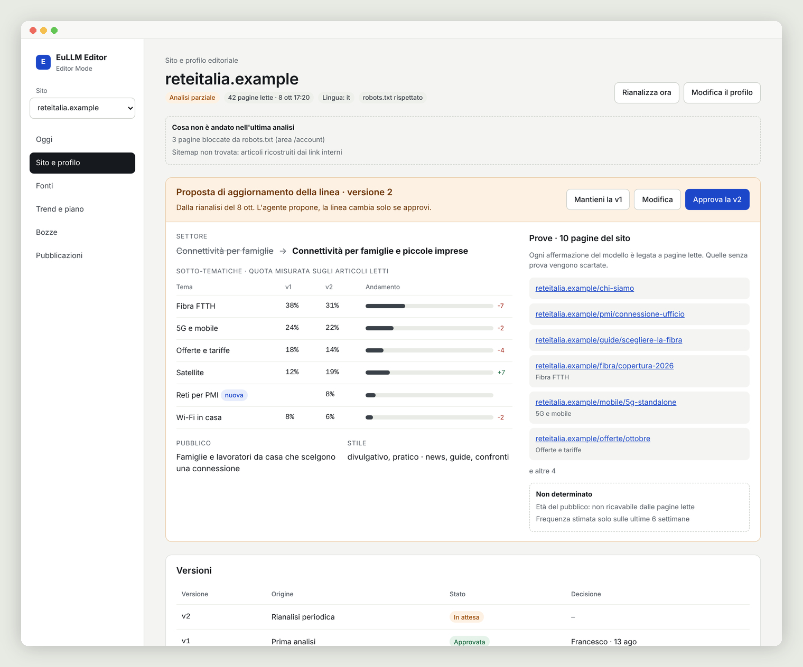
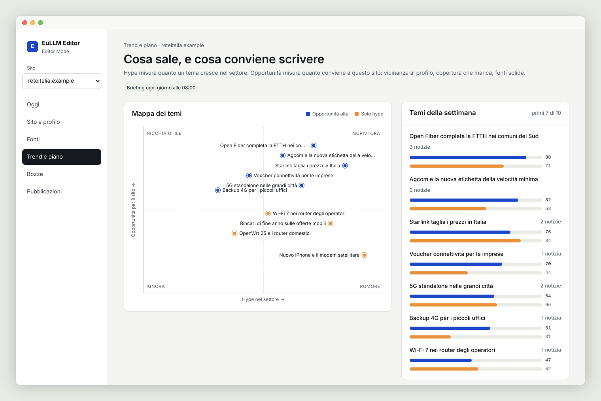
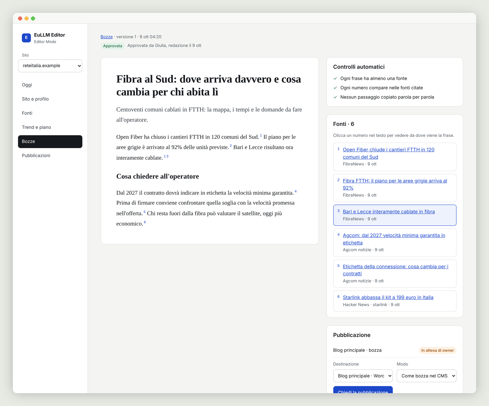
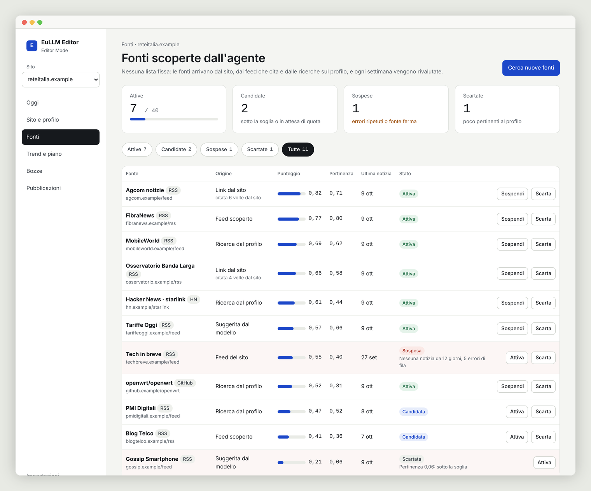

# EuLLM Agent: Editor Mode

Part of EuLLM Agent, licensed under [AGPL-3.0-or-later](../LICENSE). Copyright I3K Technologies Srl.

Editor Mode is the first specialised mode of EuLLM Agent. It runs on top of
the general-purpose Core and never talks to a model provider or to the web
by itself: model calls go through `POST /v1/llm/chat` and every page of a
site under analysis through `POST /v1/fetch` (address checks, size limit,
per-host pace, audit), with the tenant's token.

Domain-first: given a domain, Editor Mode analyses the site, writes a draft
editorial profile with evidence for every choice, discovers and rates
sources, follows trends, scores Hype and Editorial Opportunity separately,
proposes a plan and drafts articles whose every claim cites a stored source.
People approve profiles and every external action.

## Dashboard

Seven pages, server-rendered, no JavaScript needed, same roles and checks as
the API. Viewers read, editors decide proposals and drafts, owners approve
profiles, sources and publications.

| Page | What it does |
| --- | --- |
| **Oggi** | Everything waiting for a decision, the day's top opportunities, plan usage. |
| **Sito e profilo** | The profile with its evidence; on re-analysis, the proposed new line next to the approved one. |
| **Fonti** | Discovered sources with score, origin and status; activate, suspend or reject. |
| **Trend e piano** | Hype against Opportunity on one map, and the plan to accept or discard. |
| **Bozze** | The draft with numbered sources per sentence and the automatic checks. |
| **Pubblicazioni** | Requests waiting for an owner, history, WordPress / webhook / Telegram targets. |
| **Impostazioni** | Plan meters, briefing recipients, access tokens. |

<table>
<tr>
<td></td>
<td></td>
</tr>
<tr>
<td align="center">The line is moving: the agent proposes, the owner decides.</td>
<td align="center">Hype is not opportunity: what is worth writing for this site.</td>
</tr>
<tr>
<td></td>
<td></td>
</tr>
<tr>
<td align="center">Every sentence has a source; click a number to see it.</td>
<td align="center">No fixed list: sources are found, rated and re-rated.</td>
</tr>
</table>

Screenshots use demo data on fictitious `.example` domains.

## Setup

1. **Core.** Enable fetch and give Editor Mode a token per tenant in the
   Core configuration (`eullm-agent token new` prints the token and its
   SHA-256; only the hash goes in the file). Limits in `api.tenants` are the
   Core's own guard; Editor Mode keeps its plan limits on top.

       api:
         tokens:
           - name: editor-acme
             tenant: editor-acme
             token_sha256: "<sha256>"
         fetch: {}
         tenants:
           editor-acme: {max_cost_per_month: 50.0, max_fetches_per_day: 20000}

2. **Database.** The migrations create the schema `editor` and the role
   `editor_app` (NOLOGIN, NOBYPASSRLS). The application connects with a login
   role that is a member of it, so row-level security always applies:

       CREATE ROLE editor_web LOGIN PASSWORD '...' IN ROLE editor_app;

3. **Environment.**

   | Variable | Meaning |
   |---|---|
   | `EDITOR_DATABASE_URL` | application connection (`editor_web`) |
   | `EDITOR_ADMIN_DATABASE_URL` | owner connection, for `migrate` and `tenant-plan` |
   | `EDITOR_CORE_URL`, `EDITOR_CORE_TOKEN`, `EDITOR_CORE_MODEL` | Core address, default token, model or profile name |
   | `EDITOR_TIMEZONE`, `EDITOR_BRIEFING_HOUR` | defaults: Europe/Rome, 8 |
   | `EDITOR_SMTP_HOST`, `EDITOR_SMTP_PORT`, `EDITOR_SMTP_USER`, `EDITOR_SMTP_PASSWORD`, `EDITOR_MAIL_FROM` | briefing by email (STARTTLS) |
   | `EDITOR_TELEGRAM_TOKEN` | briefing by Telegram |
   | `EDITOR_SECRET_<TENANT>__<NAME>` | credentials of a publishing target (WordPress application password, webhook signing key, Telegram channel bot token). The tenant names the target's secret `<NAME>`; the tenant id is upper-cased with `-` as `_`, e.g. `EDITOR_SECRET_RAG_ENTERPRISE__WP` |
   | (Core) `api.fetch.credentials` | optional: a GitHub token for `api.github.com`, set in the Core's config, raises the GitHub API rate limit for source discovery |

4. **First tenant and site.**

       uv run editor migrate
       uv run editor tenant-add editor-acme --name "ACME"
       uv run editor tenant-plan editor-acme --plan pro --max-sites 4 \
           --max-cost-month 40 --core-token-env EDITOR_CORE_TOKEN_ACME
       uv run editor token-new --tenant editor-acme --name francesco   # dashboard login
       uv run editor recipient-add --tenant editor-acme --channel email --address me@example.com
       uv run editor site-add example.com --tenant editor-acme
       uv run editor profile-show example.com --tenant editor-acme
       uv run editor profile-approve example.com 1 --tenant editor-acme --by francesco

   `site-add` declares when the analysis is partial or insufficient. Sources
   are collected at once, but no opportunity score or proposal is made for a
   site until a person approves its profile (here or in the dashboard).

5. **Run.**

       uv run editor worker --apply-schema   # hourly tick: collection, briefing at 08:00 local, maintenance, reviews
       uv run editor serve --port 8090       # dashboard and API

Drafts and publications are started from the dashboard or the API; every
publication waits for an owner's approval.

## Development

    uv sync
    EDITOR_TEST_DATABASE_URL=postgres://postgres@localhost:5432/postgres uv run pytest

Database tests create and drop their own database; without the variable
they are skipped.
